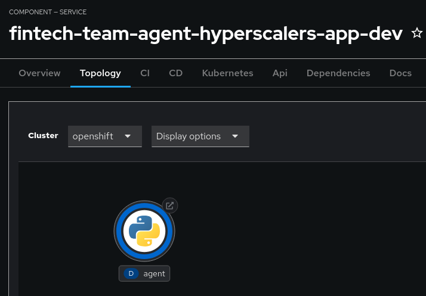
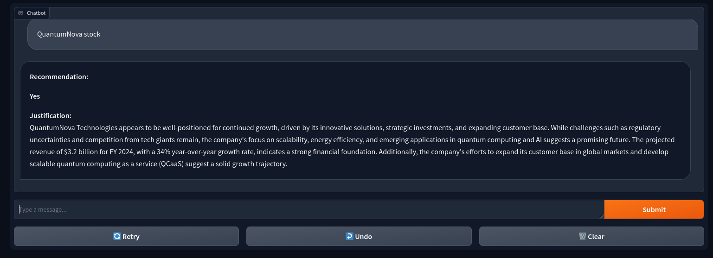
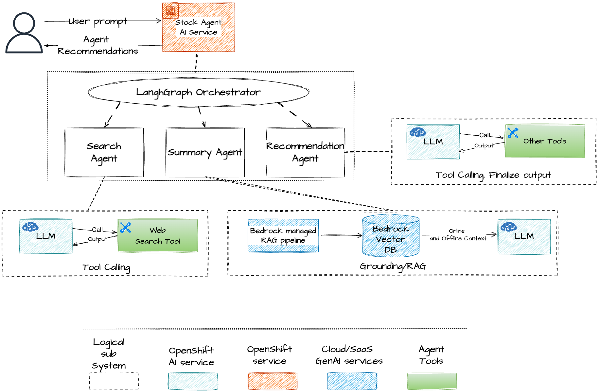
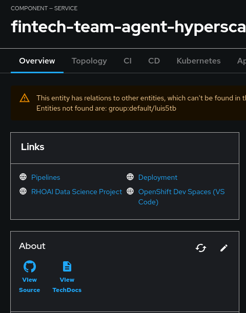
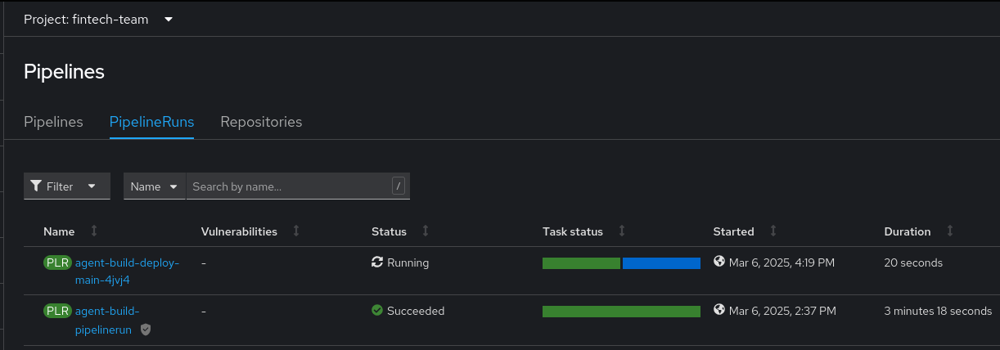
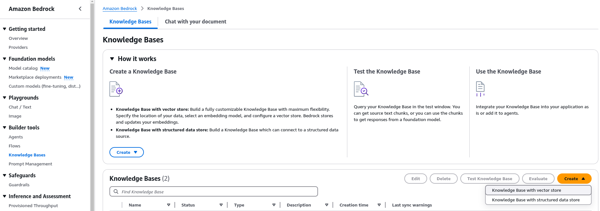
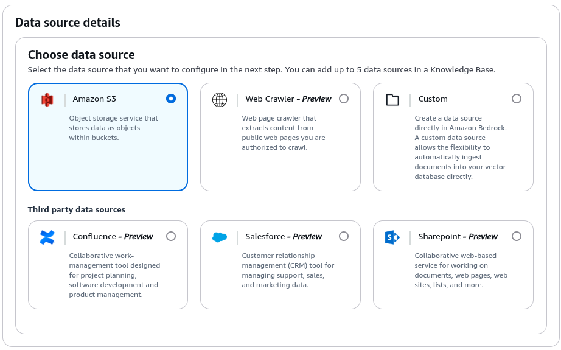
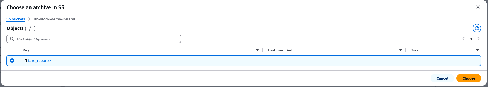
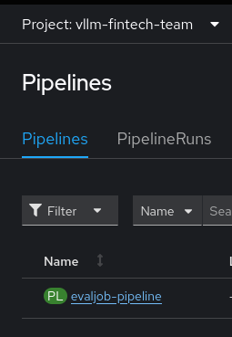

# Agent Walk Through
After the template is fully deployed you can:
- Start interacting with the deployed Agents through the Gradio server.
- Make changes to the Agents’ code and redeploy
- Evaluate the deployed LLM by leveraging TrustyAI Evaluation Jobs.

## How to Use the Agent to recommend and analyze stocks data

At the Developer Hub Catalog, you can check the topology of the template deployed and see the Agent deployed. Click on it to interact with it:




Even if this appears as a single Pod in OpenShift, internally it has several logical components (or independent agents), as depicted in the next figure:
- Gradio is used to create a simple UI
- LangGraph is used for multiagent orchestration
- The deployed system consists of three specialized agents working together to analyze stocks -- all leveraging the LLM deployed in OpenShift AI with the template:
  1. **Search Agent** - Gathers real-time stock information from the internet using DuckDuckGo. It follows a ReAct pattern and can make several calls to the tool until it gets all the relevant information.
  2. **Summary Agent** - It uses the realtime search data passed by the orchestrator from the Search Agent, and it performs similarity search using AWS Bedrock Knowledge Base to access internal docs. Then sends the augmented prompt to the LLM to perform a summary of the stock.
  3. **Recommendation Agent** - It uses the summary passed by the orchestrator (generated by the Summary Agent) and performs a final analysis to provide a recommendation for the stock with the reasoning.



## How to Make changes to the Agent application

To change the (LangGraph) Agent(s) code, there is 2 options available at Red Hat Developer Hub:
- **OpenShift Dev Spaces** : Click on the link to OpenShift Dev Spaces (VS Code) for a web-base VS Code Environment where you can directly edit the code and push the changes to the associated GitHub repository.
- **GitHub** : Use the "View Source" link to directly edit code in your GitHub repository (the one created for the Agent code by the Developer Hub template.)



Pushing changes trigger an automatic pipeline (PipelineRun) to build the new Agent Service image. After the build completes, go to the deployment and manually trigger a redeployment to use the new image.



## Using Bedrock Knowledge Base- managed RAG service on AWS

The Bedrock Knowledge Base is a managed RAG service on AWS that is used to store and retrieve information from a knowledge base. It is used by the Summary Agent to retrieve information from a knowledge base.

The process to create a new Knowledge Base in AWS Bedrock is the standard one:
1. Go to AWS Bedrock's `Builder tools` > `Knowledge Bases`
2. Create a new `Knowledge Base with vector store`

3. Select the desired Data Source, e.g., Amazon S3.

4. You need to precreate a new S3 bucket for the Knowledge Base, and upload the documents you want to use as the Knowledge Base. Then select them in the form.

5. Once the form is filled, click on `Create` and wait for the Knowledge Base to be created.
6. Get the Knowledge Base ID, needed to configure the secret.

Then, to configure its usage, you need to create a secret with the correct credentials for the AWS Knowledge Base. If using the Validated Pattern, you need to configure credentials in `values-secret.yaml.template` file with the correct AWS Knowledge Base credentials:

```yaml
- name: vectordb-keys
  fields:
  - name: VECTORDB_PROVIDER
    value: AWS
  - name: AWS_KNOWLEDGE_BASE_ID
    value: XXXX
  - name: AWS_REGION_NAME
    value: XXXX
  - name: AWS_ACCESS_KEY_ID
    value: XXXX
  - name: AWS_SECRET_ACCESS_KEY
    value: XXXX
```

### Azure AI Search Configuration
Similarly, Azure AI Search Service is also supported. You can use it just by changing the VECTORDB_PROVIDER environment variable to "AZURE" and setting the correct Azure AI Search Service credentials. If using the Validated Pattern, you need to update the values-secret.yaml.template file with the correct Azure AI Search Service credentials:

```yaml
- name: vectordb-keys
  fields:
  - name: VECTORDB_PROVIDER
    value: AZURE
  - name: AZURE_AI_SEARCH_SERVICE_NAME
    value: XXXX
  - name: AZURE_AI_SEARCH_API_KEY
    value: XXXX
  - name: AZURE_AI_INDEX_NAME
    value: XXXX
```

For the demo, we have added couple of files with fake data about 2 companies. You can see the data uploaded here: [fake_reports directory](https://github.com/luis5tb/developerhub-agentic-demo/tree/main/skeleton/fake_reports) developerhub-agentic-demo/tree/main/skeleton/fake_reports. And see that the reply from the agent actually includes the data from the uploaded files.

## Run the Trusty AI Evaluation Job
You can evaluate the LLM's performance using TrustyAI. To trigger the evaluation you need to execute the Pipeline created by the Developer Hub template. This is a manual process:
1. Navigate to the vllm namespace.
2. Trigger the evaluation Pipeline manually with the desired parameters.
3. Choose between using a set of task/subtask (`TaskList`) or using a custom `TaskRecipe`.
4. The pipeline will execute a task that creates a LMEvalJob CR with the selected parameters
5. The TrustyAI service reacts to the LMEvalJob CR and creates a new Job to run the evaluation
6. You can monitor the results in the Job Logs or at the LMEvalJob CR status.



On top of the pre-deployment evaluations we plan to add runtime guardrails to serve as a gateway between the agents and the LLM -- with a few examples for guardrails inspired by hyperscalers predefined ones.
